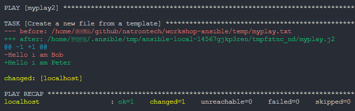

# Check and diff mode
Ansible allows you to run a playbook in check and mode. This will not make any changes to the system, but will show you what changes would be made if you would run the playbook without check mode.

This can be very useful if you want to check if your playbook is idempotent or if you want to see what changes would be made to your system.

## Check mode
Check mode will run the playbook and not make any changes to the system. 
It will show you if changes would be made.
Check mode can be enabled by using the `--check` flag when running the playbook.

```bash
ansible-playbook playbook.yml --check
```

## Diff mode
Diff mode will show you the changes that are be made to the system.
The Ansible module needs to support diff mode to show a clean output of the changes done.
```bash
ansible-playbook playbook.yml --diff
```

## Using check and diff mode together
This is the most useful way to check your playbook.
It show all changes that would be made to the system but will not make any changes to the system.
```bash
ansible-playbook playbook.yml --check --diff
```

This is an example of the output of a playbook that is run in check and diff mode with the template module:

{ width="800" }

## Reference
[Ansible check and diff mode](https://docs.ansible.com/ansible/latest/playbook_guide/playbooks_checkmode.html)