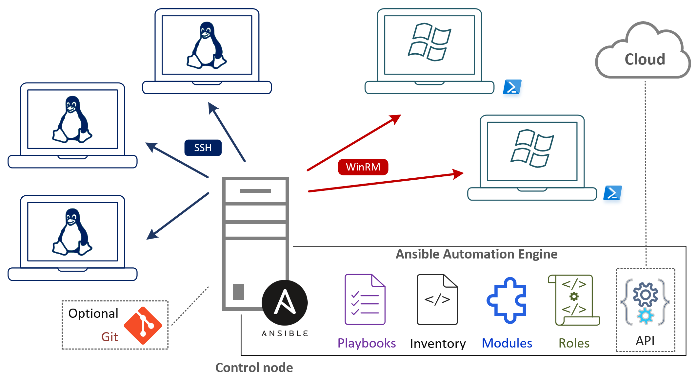

# Ansible control node
Ansible requires a control node to be run.
The control node can be a server or your local computer.
Ansible will connect to the remote systems **directly from the control node**, therefore network connectivity from the control node to the remote systems is required.

<figure markdown>
  { width="800" }
  [^1]
</figure>

The ansible binary is installed and run on the control node.
The connection to the remote systems is established using SSH, WinRM or HTTPS.

[^1]: <a href="https://www.kreyman.de/index.php/others/linux-kubernetes/213-ansible-verwendungsszenarien" title="process icons">Ansible Verwendungsszenarien</a>